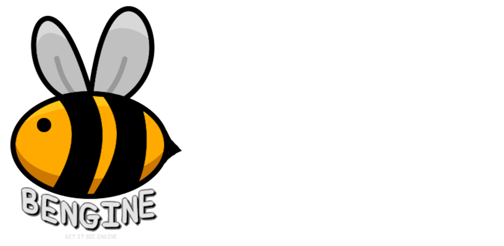
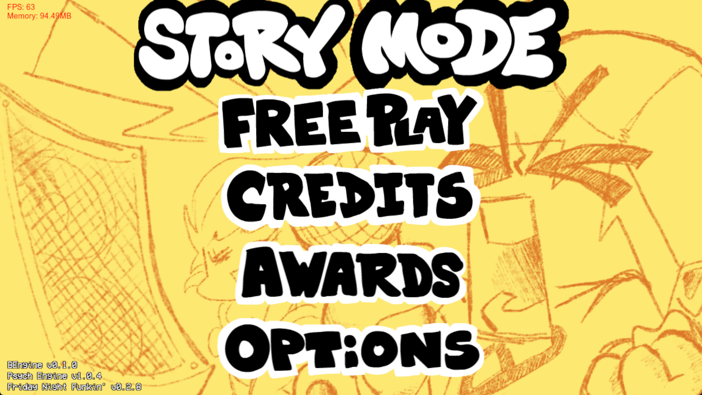
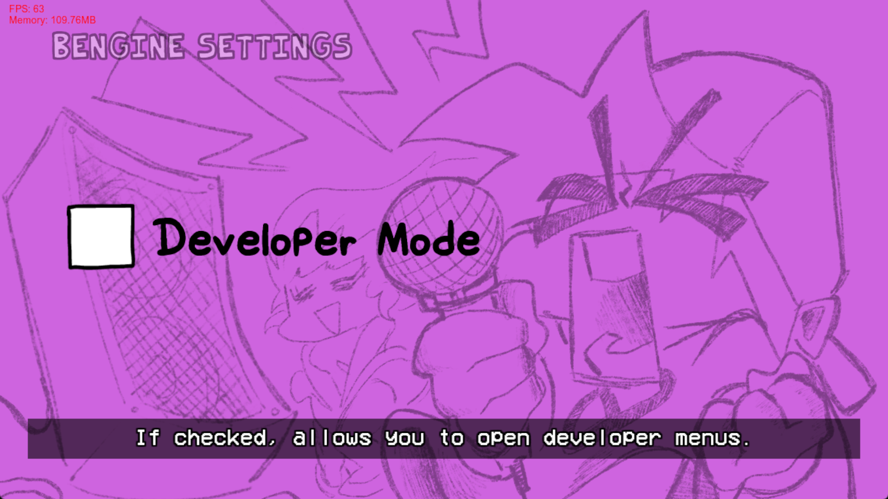
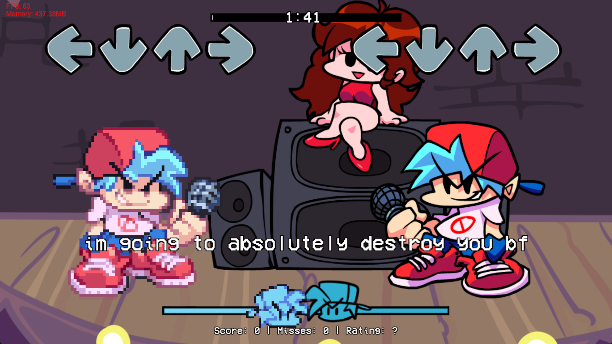
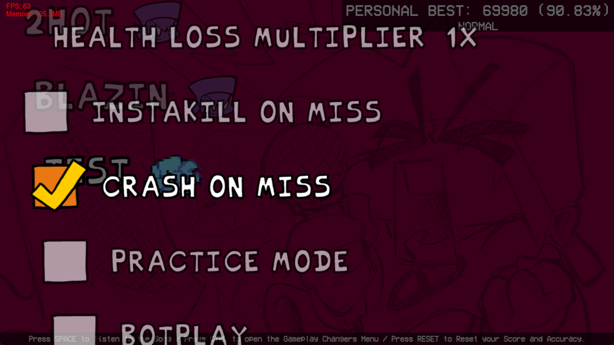

A Pretty Simple Fork of Psych Engine 1.0.4

## Credits:

* Shadow Mario - Main Programmer and Head of Psych Engine.

* Riveren - Main Artist/Animator of Psych Engine.

***

# Features

## The Classic Main Menu

* The old main menu from Pre-Psych 1.0
  

## New Settings

* A Developer Mode for enabling the developer menus
  

## New Events

* The Lyrics Event
* Allows you to add lyrics to your song!
  

## New Gameplay Modifiers

* A New Crash on Miss Gameplay Modifier (tbh idk why you would need this but its there)
  

## Other Features

* Cool Bee as the logo
* Kade Engine lookin Song Watermarks
* "Test" is a song you can play through freeplay!

***

# Installation

1. Download the latest build from Releases.
2. Extract the Zip.
3. Open BEngine.exe
4. If you want to start modding, enable Developer Mode in the Settings!

#### BEngine by Bartollo12, Psych Engine by ShadowMario, Friday Night Funkin' by ninjamuffin99
